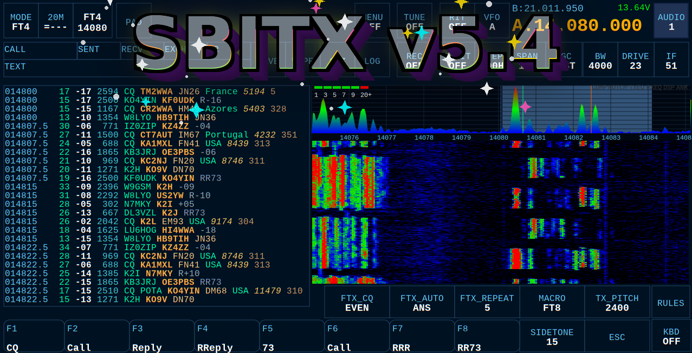

# sBitx - 64-Bit Version



An improved version of the sBitx application designed for the sBitx hardware. This version is only for the 64-bit Raspberry Pi image, which can be downloaded [here](https://github.com/drexjj/sbitx/releases).

## 🤖 NEW: AINR — AI Noise Reduction

**In plain words:** AINR uses a small artificial intelligence model that has listened to thousands of hours of human speech mixed with every kind of noise, and has learned to tell the two apart. Instead of just turning down frequencies that seem loud (like traditional noise reduction), it asks a smarter question — *"does this sound like a person talking?"* — and silences everything that doesn't. The result is dramatic: band hiss and static between words can drop to near-total silence while the voice comes through untouched. Turn it on with the **AINR** button on the main screen (left of REC) or type `\ainr on`. It works in voice modes (SSB/AM/FM) and stays automatically out of the way in FT8 and other digital modes.

**Technically:** AINR integrates [RNNoise](https://github.com/xiph/rnnoise) (Xiph.org), a GRU-based recurrent neural network for real-time speech denoising, into the RX audio path after the demodulator and modem taps and before the RX equalizer. The 96 kHz speaker stream is decimated to 48 kHz, automatically level-normalized toward the network's trained operating range (so performance is independent of the IF gain setting), processed in 480-sample frames, then wet/dry mixed against a sample-aligned dry path and interpolated back to 96 kHz — adding roughly 10–20 ms of latency. The network's per-frame voice-activity probability additionally drives adaptive mixing with fast-attack/slow-release smoothing, relaxing suppression while speech is detected so weak, fading signals aren't gated away. Two parameters are adjustable from the UI (they appear beside the AINR button while it is on) or the console: **AINRS** (`\ainrs 0-100`, default 80) sets overall strength as a wet/dry mix — 100 gives the deepest silence, lower values blend original audio back in for a smoother sound; **AINRV** (`\ainrv 0-50`, default 25) sets how far suppression backs off when speech is detected — 0 for maximum quieting on strong signals, higher values to protect weak syllables at the cost of some noise "halo" around words. A good starting point is AINRS 80–100 with AINRV 25; use AINR *instead of* DSP or ANR rather than stacked with them.

## 🚀 Core Development Team

We have an incredible development team collaborating on improvements for the sBitx platform:

- **JJ - W9JES**
- **Mike - KB2ML**
- **Bob - KD8CGH**
- **Jared - KJ5DTK**
- **Shawn - K7IHZ**

A huge thank you to everyone who contributes their time and expertise to this project!

## Release Notes
[Available Here](https://github.com/drexjj/sbitx/blob/main/release_notes.md)


## 📂 File Compatibility

The files here are designed to work on the modified, 64-bit version provided in the [Releases](https://github.com/drexjj/sbitx/releases) section.

- **sBitx Toolbox for 64-bit**: [Available Here](https://github.com/drexjj/sBITX-toolbox64)

## 🔴 Backup Your Data First!

Before installing this version, **backup your existing** `sbitx/data` **and** `sbitx/web` **folders** to a safe location. This ensures you don’t lose important data such as your logbook, hardware calibration, and user settings.

### Backup Methods

#### 1️⃣ sBITX EZ Data (Recommended)

A built-in backup utility for both the factory and 64-bit versions of sBitx. This tool copies your critical data files to a USB drive. It can be installed from the sBitx Toolbox.

#### 2️⃣ Manual Backup

Alternatively, you can manually back up your data using the terminal:

```console
cd $HOME && mv sbitx sbitx_orig
```

To restore your backup after installation:

```console
cd $HOME && cp -r sbitx_orig/web/*.mc sbitx/web/ && cp -r sbitx_orig/data/* sbitx/data/
```

## 🔧 Installation & Upgrades

For detailed installation and upgrade instructions, please visit the [Wiki Page](https://github.com/drexjj/sbitx/wiki/How-to-install-or-upgrade-your-sBitx-application).

## 📥 Download the 64-Bit Image

A preconfigured, downloadable Raspberry Pi 4/5 image file is available. This image is designed for a **32GB SD card or USB drive** and can be installed using **Balena Etcher** or **Raspberry Pi Imager**.

**Bonus**: The image comes preinstalled with sBITX Toolbox and other useful ham radio tools.

🔗 [**Download the latest version**](https://github.com/drexjj/sbitx/releases)

## 👏 Contributors & Credits

A huge thank you to the contributors who have played a vital role in this project!

### Special Thanks To:

- **Jon - W2JON**
- **Alan - N1QM**
- **Lee - W4WHL**
- **Lars - OZ7BX**
- **Jeff - KF7DYU**
- **Mike - KB2ML**
- **Shawn - K7IHZ**
- **Jared - KJ5DTK**
- **Chris - W0ANM**
- **Gyula - HA3HZ**
- **Pete - VK3PYE**
- **Mike - WD0OM**
- **Paul - G0KAO**
- **Don - KK7OIM**
- **Fabrizio - F4VUK**
- **Bob - KD8CGH**
- **Farhan - VU2ESE**
- **Bob - W7PUA**
- **Phil - KA9Q**
- **Gerald - K5SDR**
- **Evan - AC9TU**
- **Steve - N3SB**


## 🌟 Support the Project

If you find these enhancements valuable or have benefited from using sBitx, consider supporting our work. Every donation, big or small, helps us keep development going.

💖 [**Support Our Work and Give Thanks**](https://www.patreon.com/cw/RadioElectronicsHub) or make a 1 time donation [**Here**](https://www.paypal.com/donate/?hosted_button_id=SWPB76LVNUHEY) 💖

Can't donate? No worries! Contributing code, documentation, or spreading the word also makes a big impact.

Thank you for your support and belief in this project!

